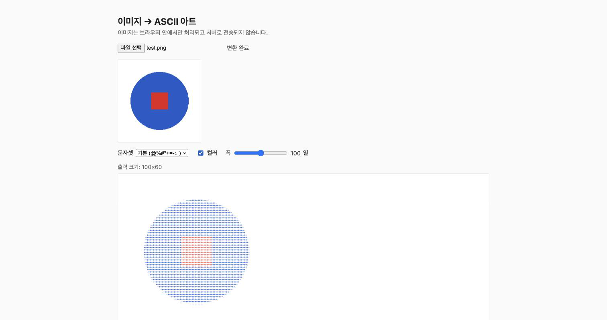

# 이미지 → ASCII 아트 변환기

이미지를 업로드하면 브라우저 안에서 바로 ASCII 아트(텍스트)로 변환해주는 가벼운 웹앱입니다. 서버도, 외부 라이브러리도 없습니다.

## 사용법

`index.html`을 브라우저로 열면 바로 동작합니다.

1. 이미지 파일 선택 (PNG/JPEG/WebP, 최대 10MB)
2. 자동으로 ASCII 아트 변환
3. 문자셋 / 컬러 여부 / 출력 폭 조절 가능
4. 결과를 텍스트로 복사하거나 `.txt`로 다운로드

## 동작 방식

Canvas API로 이미지를 지정한 열×행 크기로 축소해 픽셀을 읽고, 각 픽셀의 밝기(`0.2126R + 0.7152G + 0.0722B`)를 문자셋의 진하기에 매핑합니다. 이미지는 서버로 전송되지 않고 전부 브라우저에서 처리됩니다.

## 스택

Vanilla HTML/CSS/JS 단일 파일. 프레임워크·빌드 도구·외부 의존성 없음.

## 만든 과정

[Codex](https://openai.com/codex)로 기획([PLAN.md](./PLAN.md)) → [Claude Code](https://claude.com/claude-code)로 구현한 워크플로우 실험 프로젝트입니다.
